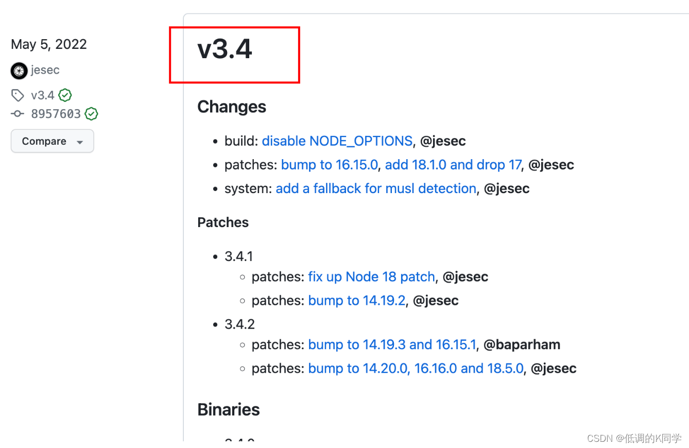
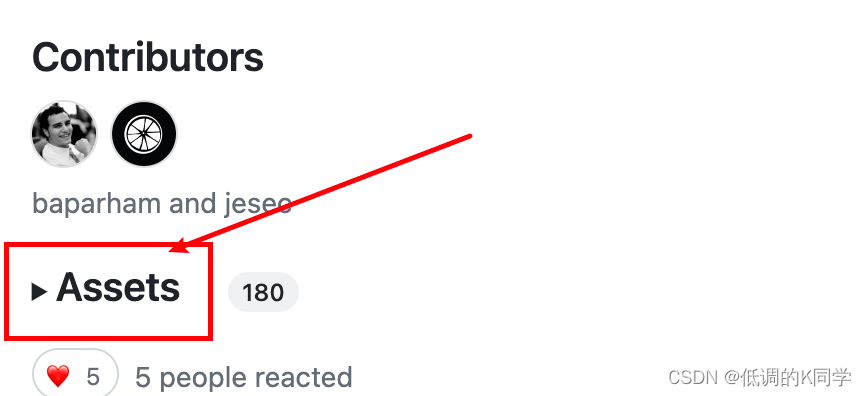
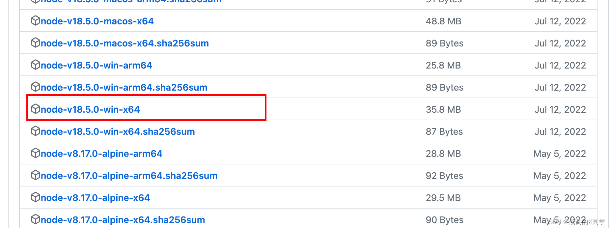
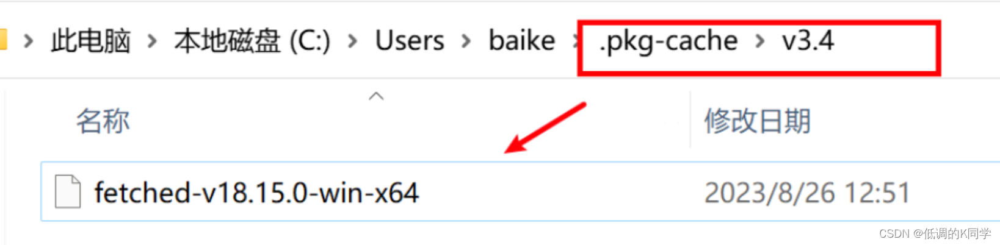
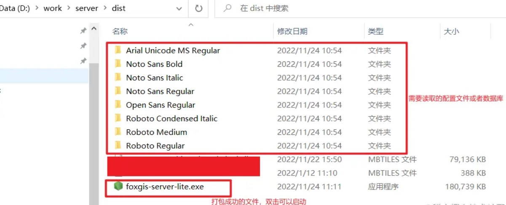

# pkg打包nodejs应用步骤
### pkg原理
pkg实际上并不是直接将程序转换成可执行文件，而是将node环境一起打包到了程序中，这样就可以做到不用在没有node环境下的电脑上运行node项目

### 完整安装Nodejs
完整安装node-v18.15.0-x64.msi，选择完整安装，安装同时勾选 安装c++编译模块的构建工具。构建工具是因为一些npm模块需要使用C/C++编译，如果想要编译这些模块，则需要安装这个工具。如果不安装这个构建工具，在之后使用 npm 安装模块的时候，会报错。


### 全局安装pkg
```js
npm install pkg -g
```
pkg版本号@5.8.1
### 修改nodejs应用下的package.json文件
```js
{
  "name": "123",
  "version": "1.0.0",
  "description": "",
  "main": "index.js",
  "scripts": {
    "test": "echo \"Error: no test specified\" && exit 1"
  },
  "author": "",
  "license": "ISC",
  "dependencies": {
    "chalk": "^2.4.2",
    "csv-parser": "^3.0.0",
    "detect-file-encoding-and-language": "^2.4.0",
    "exceljs": "^4.4.0",
    "fast-csv": "^5.0.0",
    "iconv-lite": "^0.6.3",
    "inquirer": "^5.0.0",
    "ora": "^5.4.1"
  },
  "bin":"app.js",
  "pkg":{
    "outputPath":"executables",
    "targets":[
      "node18-win-x64"
    ]
  }
}

```
bin: pkg打包入口
outputPath: 输出应用路径
targets: 编译目标平台
### 首次编译尝试
在nodejs应用路径下执行 **pkg .** 运行打包过程，执行**pkg .** 或者**pkg package.json**命令。如果有错误提示，查看错误提示需要使用的编译组件是哪个版本的node-vx.x.x-win-x64，比如这里是需要加载fetched-v18.5.0-win-x64 组件

### 下载编译组件
登录https://github.com/vercel/pkg-fetch/releases    在页面上的v3.4更新日志记录中找到Assets链接，点开下面折叠的各版本组件，node-v18.5.0-win-x64，下载后重命名为fetched-v18.5.0-win-x64

### 拷贝编译组件到pkg-cache目录
在pkg缓存目录中新建v3.4文件夹 C:\Users\Administrator\.pkg-cache\v3.4 并将fetched-v18.5.0-win-x64拷贝到v3.4目录下

### 再次编译
重新执行pkg .或者pkg package.json命令进行打包


### pkg打包nodejs应用的一些坑

1. 项目中不要使用esmodule规范导入模块，改用commonjs规范。或者使用webpackage打包工具将代码编译成es5

2. 项目中不要使用各平台不一致的库，比如v8 模块

3. 项目中如果使用path.join方法拼接__dirname或__filename路径，拼接中的变量如果在其他目录中，就必须在package.json中配置pkg的"asset"s:[]配置项，以指定无法被自动打包的路径。建议使用process.cwd()拼接

4. 如果打包出来的应用闪退，可以在命令行中调用该应用，在命令行中可以看见错误信息。用cmd 来执行，cmd 进入到文件所在目录，执行该应用。

5. 缓存中找不到二进制文件
这里无法找到名称为 **fetched-v18.5.0-linux-x64**的文件，在windows平台提示无法找到的文件应该是 **fetched-v18.5.0-win-x64**

```shell
$ pkg index.js
> pkg@5.7.0 
> Targets not specified. Assuming: node16-linux-x64, node16-macos-x64, node16-win-x64 
> Fetching base Node.js binaries to PKG_CACHE_PATH fetched-v16.15.0-linux-x64 [ ] 0%> Not found in remote cache: {"tag":"v3.4","name":"node-v16.15.0-linux-x64"} 
> Building base binary from source: built-v16.15.0-linux-x64 
> Error! Not able to build for 'linux' here, only for 'win'
```
首先去找到.pkg-cache文件夹下查看PKG 的版本号，这里的PKG的版本号是V3.4

去fetched文件下载网址对照手工下载fetched文件
打开链接：https://github.com/vercel/pkg-fetch/releases



将node-v18.15.0-win-x64文件改名为<font style="color:red;font-weight:bold">fetched-v18.15.0-win-x64</font>放到.pkg-cache -> v3.4这个文件夹下 (这里示例的版本是v18.15.0，实际情况需要根据编译时的错误提示下载对应的具体版本)

注意这里你下载的是win系统，打包就会生成exe win系统的执行文件，其他系统要用，就下载其他系统的二进制文件；（下载那个就会打包那种系统的！）

6. js和静态文件的处理方法
pkg打包会从入口开始根据依赖去找相关资源，并把这些都打包进去，不过直接打包这种情况仅限于require引用方式，如果项目代码中有用到__dirname拼接变量的形式，就要在packge.json中进行配置
如：项目中通过__dirname来读取views和public的文件
```js
app.set('views',path.join(__dirname, './views'))
app.use(express.static(path.join(__dirname, './public')));
```
以上代码中views与public文件夹中的文件都不会被pkg自动打包，需要进行配置：
```js
{ 
    "script": {}, 
    "pkg": { 
        "assets": ["public/**/*","views/**/*"], 
        "scripts": "workers/**/*.js" 
    }, 
}
```
assets：表示静态资源相关配置，像public/**/* 这种通配符写法，表示public下所有文件都被打包进去了;
scritps：表示需要配置才能打包的js脚本

7. 缺少文件，静态文件读取失败 的处理方法
pkg只识别require,__dirname、__filename和process.cwd加载的文件，
如果代码中使用__dirname和__filename 动态拼接的写法，必须要在assets中配置拼接的目录
process.cwd读取外部文件，比如项目有数据库文件，需要读取，把数据库文件和打包的exe文件放在一起，通过process.cwd来读取
__dirname和__filename的区别
__dirname：D://work/service/data
__filename：D://work/service/data/index.js
